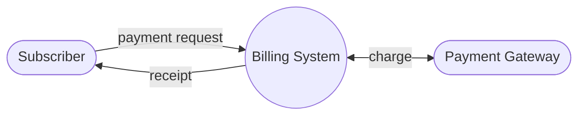
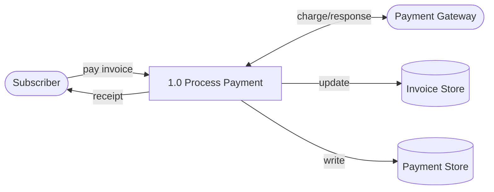
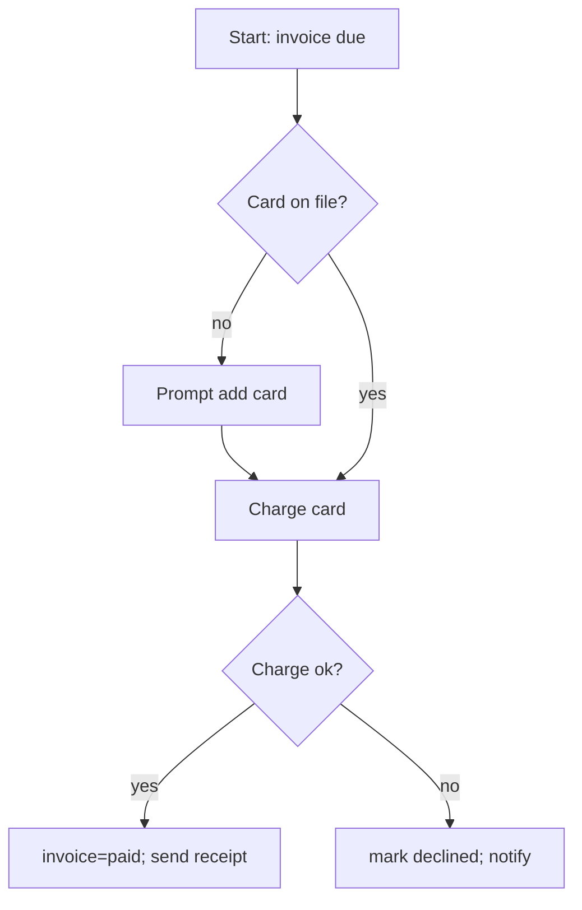
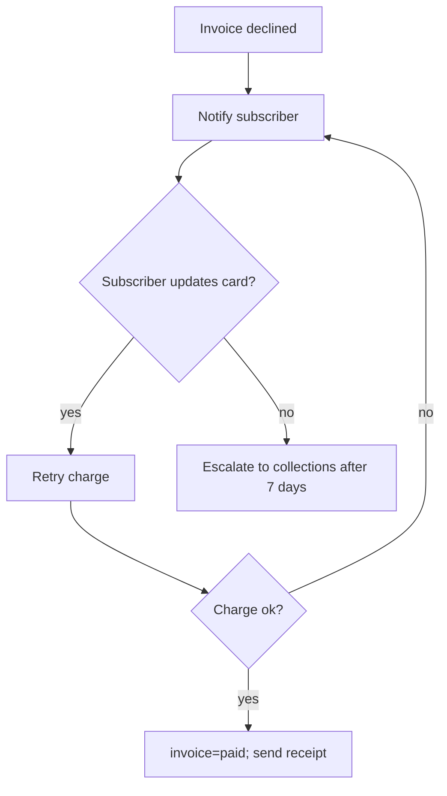
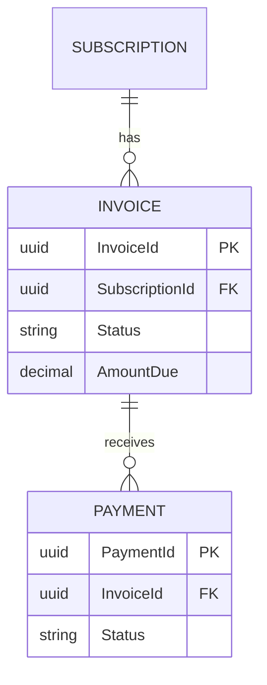
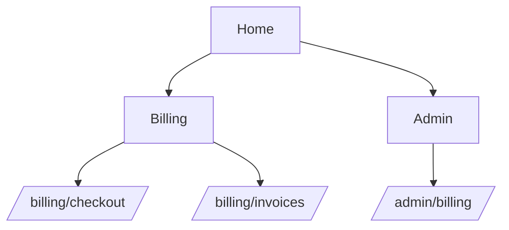

# System Design Document — Billing Module

## 1. Introduction & Overview

ระบบ Billing Module เป็นส่วนหนึ่งของแพลตฟอร์ม SaaS ที่ทำหน้าที่จัดการการเรียกเก็บเงินรายเดือน
ตั้งแต่การออก invoice ให้ผู้ใช้งาน (subscriber) จนถึงการชำระเงินผ่านบัตรเครดิตและการออกใบเสร็จ

- **วัตถุประสงค์**: ลดขั้นตอนการชำระเงินที่ซับซ้อน ให้ subscriber จ่ายบิลได้ภายในไม่กี่คลิก
- **ขอบเขต**: ครอบคลุม subscription, invoice, payment — ไม่รวมระบบบัญชี/ภาษีย้อนหลัง
- **Stakeholders**: Subscriber (ผู้ใช้งาน), Billing Admin (ผู้ดูแลระบบเรียกเก็บเงิน), Payment Gateway (ผู้ให้บริการชำระเงิน)

สถาปัตยกรรมระดับสูง: เว็บแอปพลิเคชัน (subscriber-facing) เรียก Billing API ซึ่งเชื่อมต่อกับ Payment
Gateway ภายนอกแบบ synchronous สำหรับการตัดบัตร และเก็บสถานะ invoice/payment ไว้ในฐานข้อมูลหลัก

## 2. System Requirements

**Functional Requirements**
- ระบบต้องออก invoice อัตโนมัติทุกรอบบิล (monthly)
- subscriber ต้องชำระ invoice ด้วยบัตรเครดิตที่ผูกไว้ได้
- ระบบต้องออกใบเสร็จหลังชำระเงินสำเร็จ

**Non-Functional Requirements**
- การตัดบัตรต้องตอบกลับภายใน 5 วินาที (P95)
- ข้อมูลบัตรเครดิตต้องไม่ถูกเก็บในระบบเราเอง (ใช้ token จาก gateway เท่านั้น)

**Business Rules**
- Invoice ที่ status = paid ห้ามแก้ไข AmountDue อีก
- ถ้าตัดบัตรไม่สำเร็จ ระบบต้อง notify subscriber ทันที

## 3. Module Overview

- **Billing** — ออก invoice, คำนวณยอด, ผูกกับ Subscription
- **Payment** — เชื่อมต่อ Payment Gateway, บันทึกผลการตัดบัตร
- **Notification** — แจ้งเตือน subscriber (ใบเสร็จ / แจ้งเตือนบัตรถูกปฏิเสธ)

โมดูล Billing เป็นเจ้าของ Invoice และ Subscription; โมดูล Payment เป็นเจ้าของ Payment และเรียกใช้
Billing เพื่ออัปเดตสถานะ invoice หลังตัดบัตรเสร็จ

## 4. Data Model

โมเดลข้อมูลประกอบด้วย 3 entities หลัก: **Subscription** (สัญญาการสมัครสมาชิก), **Invoice** (ใบแจ้งหนี้
รายเดือนที่ผูกกับ subscription หนึ่งรายการ), และ **Payment** (ผลการชำระเงินของ invoice หนึ่งใบ
สามารถมีได้หลายครั้งกรณีตัดบัตรไม่ผ่านแล้วลองใหม่)

## 5. Data Flow Diagram

### Level 0 (Context Diagram)

### Level 1

## 6. Flow Diagrams

### Pay Monthly Invoice by Credit Card (UC-billing-001)

### Retry Declined Payment (UC-billing-002)

## 7. ER Diagram

## 8. Data Dictionary

| Entity | Field | Type | Null | Key | Constraint | Description |
|--------|-------|------|------|-----|------------|-------------|
| Subscription | SubscriptionId | uuid | N | PK | — | unique subscription id |
| Subscription | PlanCode | varchar(20) | N | — | — | subscribed plan |
| Invoice | InvoiceId | uuid | N | PK | — | unique invoice id |
| Invoice | SubscriptionId | uuid | N | FK | →Subscription.SubscriptionId | owning subscription |
| Invoice | Status | enum(draft,paid,void) | N | — | default draft | lifecycle state |
| Invoice | AmountDue | decimal(12,2) | N | — | ≥ 0 | amount owed |
| Payment | PaymentId | uuid | N | PK | — | unique payment attempt id |
| Payment | InvoiceId | uuid | N | FK | →Invoice.InvoiceId | invoice being paid |
| Payment | Status | enum(succeeded,declined) | N | — | — | outcome of the charge attempt |

## 9. Sitemap

## 10. User Roles & Permissions

| Role | Permissions | Pages |
|------|-------------|-------|
| subscriber | view own invoices, pay invoice | /billing/invoices, /billing/checkout |
| billing_admin | view all invoices, issue refund, retry payment | /admin/billing |
