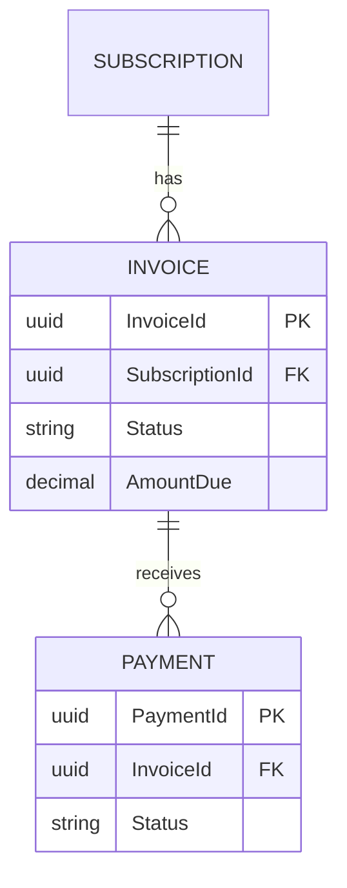
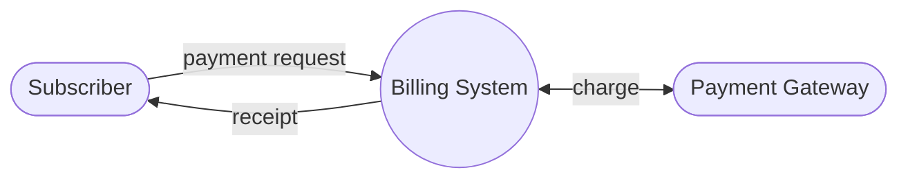
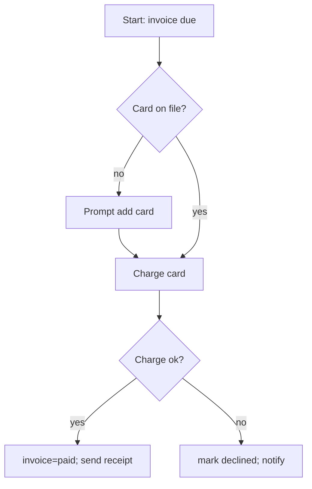
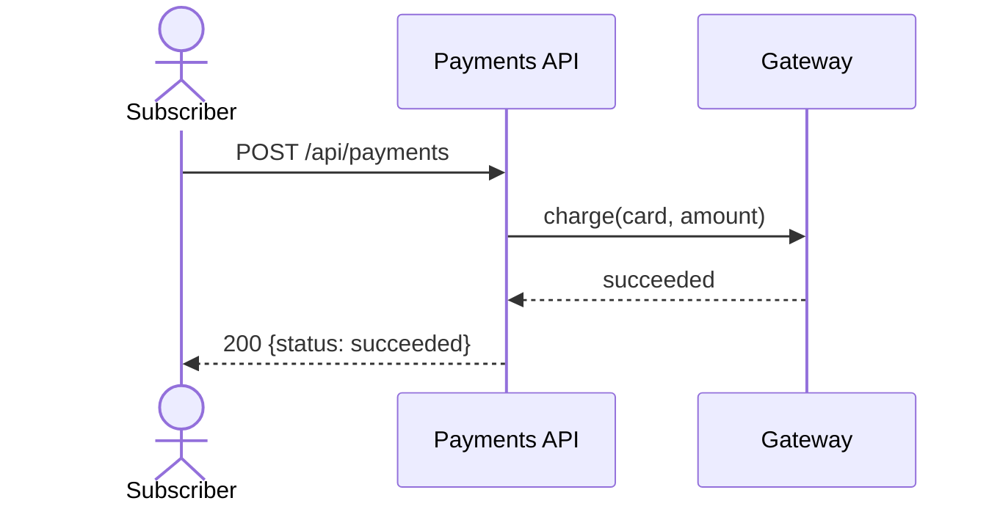
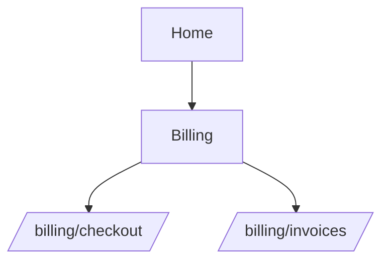
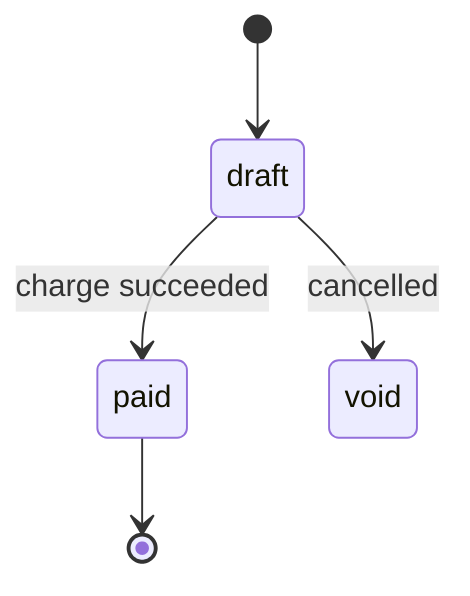
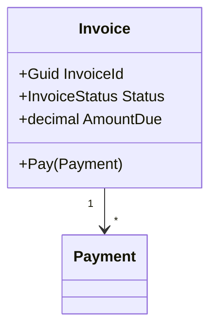

# Mermaid Patterns

> Child reference of `SKILL.md` (domain-design). Copy a pattern, fill it from the design artifacts.
> Keep every diagram consistent with the Data Dictionary and entity set (single source of truth).

## ER Diagram (Section 7) — must mirror the Data Dictionary

Rule: every entity/attribute shown here exists in the Data Dictionary and vice-versa.

## Data Flow Diagram — Level 0 (context) then Level 1

Level 1 decomposes P0 into numbered processes (1.0, 2.0 ...). DFD L0 ↔ L1 must stay consistent
(every external entity and data store in L0 reappears in L1).

## Flow Diagram (process / business logic)

## Sequence Diagram (use case interaction)

## Sitemap (navigation tree)

## State Diagram (entity lifecycle — useful for enum fields)

## Class Diagram (domain model, when DDD layering matters)

## Tips
- Prefer ER + DD as the canonical model; other diagrams must not contradict them.
- Keep node labels stable across diagrams so cross-validation (and humans) can match them.
- For `has_ui == false` scenarios, skip the sitemap node; a DFD/sequence usually communicates better.
